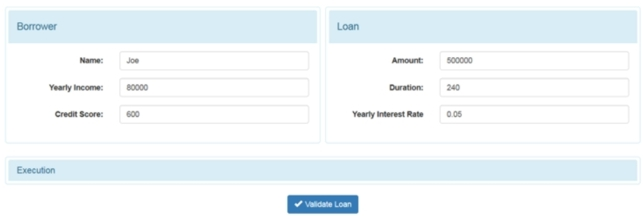
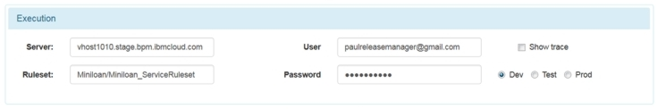
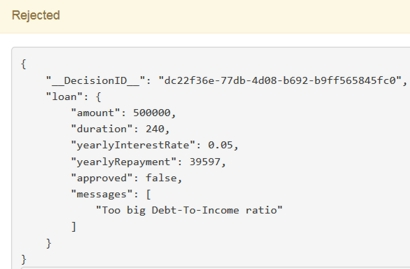
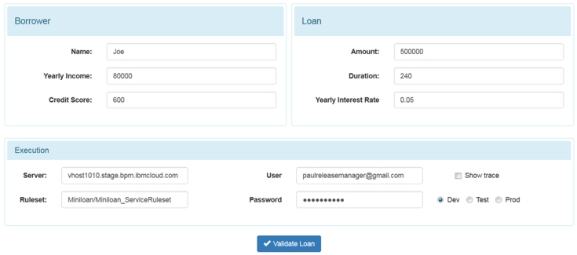

# Task 6: Calling the rules from a client application

You have deployed the rules from the decision service. Now, you can set up a client application to call the rules from the execution server in the development environment.

This task describes how an application uses the rules from the decision service. It also explains how to set up and run the application. Setting up the application is optional because it requires some technical knowledge. To set up the application, you must be familiar with Maven, and Java application servers such as IBM WebSphere Liberty and Apache Tomcat.

When you deployed the rules to Rule Execution Server, you sent a ruleset in a RuleApp to the execution server. The Miniloan client application can now call the ruleset from the server.

When the application opens, it displays default information:

In the Execution section, the parameters are set to call the ruleset from Rule Execution Server in the development environment:

The application uses the REST API with JSON for input and output. When the **Validate Loan** button is clicked, the application processes the default data and produces the following results:

## Optional: Installing the client application on a custom server

The following steps are for any integrator or other user who wants to set up a web application to use the rules from the decision service.

You need the following items to do the installation:

-   WebSphere Liberty application server from [Download the latest stable WebSphere Liberty runtime](https://developer.ibm.com/wasdev/downloads/download-latest-stable-websphere-liberty-runtime/)
-   Source files downloaded from the odm-cloud-getting-started GitHub repository
-   Version of Maven from [Apache Maven Project](https://maven.apache.org/)

## Step 1: Creating the server

You create a server to run the Miniloan Service sample application.

**Procedure**
1.   Download the Liberty application server. 
2.   Decompress the Liberty file to a directory on your computer. The directory is referred to as <WLP_Home> in the following steps. 
3.   From an administrator command prompt, create your server by running the following command: 

    
    <WLP_HOME>\bin>server create testGettingStarted
    

The command creates the folder <WLP_HOME>\\usr\\servers\\testGettingStarted, which contains the server configuration and steps.

4.   To create the profile, launch the server by using the following command: 

    
    <WLP_HOME>\bin>server start testGettingStarted

You can access the started server at http://localhost:9080.

5.   To stop the server, use the following command: 

    
    <WLP_HOME>\bin>server stop testGettingStarted
    

## Step 2: Setting up the sample application

You use Maven to build the sample web application, and then you add the application to the application server.

**Procedure**
1.   Go to the <InstallDir\>/odm-cloud-getting-started-master/miniloan-server directory. InstallDir is your directory for the extracted files from the GitHub repository that is listed in the prerequisites.
2.   In a command prompt, call `mvn clean install`. The command builds the miniloan-webapp.war file in the target directory.
3.   Copy <InstallDir\>/odm-cloud-getting-started-master/miniloan-server/target/zip to <WLP\_HOME\>/usr/servers/testGettingStarted/apps. The folder contains the .war file for the sample application: miniloan-webapp.war 
4.   Declare the sample application by adding the following lines just before *<\/server\>* in <WLP\_HOME\>/usr/servers/testGettingStarted/server.xml: 

      
    <!-- Miniloan application -->
    <webApplication id="miniloan-webapp"
    location="miniloan-webapp.war"
    name="miniloan-webapp"/>
    </application>
    
    

5.   Save the file. 

## Step 3: Running the sample application

You run the sample application.

**Procedure**
1.   Launch the server by using the following command: 

    
    <WLP_HOME>\bin>server start testGettingStarted
    

A message tells you when the build is complete. The build might take a few minutes to finish.

2.   Enter the following URL in your web browser to open the application: 

    
    http://localhost:9080/miniloan-webapp/
    

The Miniloan application opens in your browser, and displays the default values.

3.   Click **Execution** to configure the connection with your decision service. Enter the information specific to your cloud portal, for example:

4.   Click **Validate Loan** to process the default values. The application processes the request and returns the following message: 

You can find additional information by selecting **Show trace** in the Execution section and validating the data again. The additional information shows that one rule, eligibility.minimum\_income, is executed.

5.   When you finish using the sample application, close the application in your browser and stop the Liberty application server by using the following command as shown in step 1: 

    
    <WLP_HOME>\bin>server stop testGettingStarted
    

You have completed the getting started tutorial for Operational Decision Manager on Cloud. The tutorial showed you the artifacts a decision service branch, how to update and test rules, and how to deploy the rules from the decision service to an execution server. You also looked at using the rules with a client application.

For more tutorials on Operational Decision Manager on Cloud, see [Tutorials](https://www.ibm.com/support/knowledgecenter/SS7J8H/com.ibm.odm.cloud.tutorial/topics/con_tutorials_intro.html).

[ **Back to table of contents**](../README.md)

© Copyright IBM Corporation 2018

