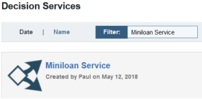

# Task 1: Preparing to do the tutorial

You download the project files for the tutorial, and gain access to the Operational Decision Manager on Cloud portal. Then, you import the Miniloan Service decision service, and create a branch in the service for your changes.

You update the Miniloan Service decision service in the Decision Center Business console in the development environment in the cloud portal. The decision service holds the business rules and related artifacts for developing and deploying a rule application that is used by a client application. The Business console contains editors for creating and editing rules, and tools for testing decision services and deploying their rules to the execution servers in the development, test, and production environments in the cloud portal.

To start the tutorial, you must first download a group of projects from GitHub. Step 1 explains how to download the files.

To use the Business console, you must have access to the cloud portal. Step 2 explains how to obtain access to the cloud portal if you do not have it.

When you have access to the cloud portal, you can work on the Miniloan Service decision service. The decision service must be imported into Decision Center through the Business console. You look for the decision service in the Business console in step 3, and if you need to import it, you follow the instructions in step 4.

Finally, when Miniloan Service is in the Business console, you create a branch for your work in the decision service. Your branch isolates your changes from the other branches in the decision service.

## Step 1: Downloading the tutorial files

You download the source files for the tutorial from Github and install them on your computer. These files are required to do the tutorial.

**Procedure**
1.   Go to the GitHub repository for the tutorial: [https://github.com/ODMDev/odm-cloud-getting-started](https://github.com/ODMDev/odm-cloud-getting-started) 
2.   Download the contents of the repository to a directory on your computer. The files are downloaded in a compressed file that is named odm-cloud-getting-started-master.zip. 
3.   Open the downloaded file <InstallDir\>/odm-cloud-getting-started-master.zip. InstallDir is used throughout the tutorial to refer to your directory for the GitHub files.
4.   Extract the contents of the compressed file to the directory. You get a new directory, named odm-cloud-getting-started-master, which contains the following items:
    -   Miniloan Service: This decision service contains the rule artifacts for approving loans. The decision service was created in Rule Designer.
    -   miniloan-xom: This Java object model describes the classes that are used in the decision service.
    -   miniloan-server: This client application uses REST to call the rules that are deployed from the decision services.
    -   Documentation for the tutorial

## Step 2: Gaining access to the cloud portal

Each instance of the Operational Decision Manager on Cloud portal has an administrator, who invites people to the cloud portal and assigns user roles.

You need a user role that gives you access to the cloud portal and the Business console. You can do this tutorial with the business user role or greater. Check with your administrator. If you already have access to the cloud portal, you can skip this step and go to step 3.

Your cloud portal has an administrator. The administrator gives other people access to the portal by sending them invitations from the portal. The invitations enable people to connect to the portal for the first time.

The administrator also assigns user roles, which determine which components can be accessed by the users. For more information, see [Cloud environments and user roles](https://www.ibm.com/support/knowledgecenter/SS7J8H/com.ibm.odm.cloud.admin/topics/con_work_env.html).

For this tutorial, it is recommended that you use one of the following user roles:

-   Business user: Works primarily in the Business console. Can update and create rules, but cannot deploy them.
-   Release manager: Can create new releases, update and test rules, and deploy decision services.

To gain access to the cloud, follow the instructions for your type of portal:

-   **Client portal**

    If your organization has an instance of the cloud portal, you must contact the administrator of the portal to gain access. For more information, see [Accessing your cloud portal](https://www.ibm.com/support/knowledgecenter/SS7J8H/com.ibm.odm.cloud.tutorials/topics/con_access_cloud.html).

-   **Sample portal**

    If you want to use the trial version of Operational Decision Manager on Cloud, you must contact IBM Support to be invited to the cloud portal. For more information, see [IBM ODM on Cloud Free Trial](https://developer.ibm.com/odm/2015/10/20/ibm-odm-on-cloud-free-trial/).

## Step 3: Checking the availability of the decision service

You determine whether the Miniloan Service decision service is already in the Business console of the development environment in the cloud portal.

**Procedure**
1.   Sign in to the cloud portal. The portal displays the resources that are available to your cloud user role.
2.   Launch the Decision Center Business console in the development environment. The console opens to its home page.
3.   Click **LIBRARY** to open the list of decision services that are currently in Decision Center. 
4.   Enter Miniloan Service in the filter to look for the decision service. 

If the Miniloan Service decision service is in the library, skip step 4 and go to step 5.

## Step 4: Importing the decision service

You import the decision service into Decision Center.

**Procedure**
1.   On your computer, open the directory that contains the extracted tutorial files from GitHub: <InstallDir\>/odm-cloud-getting-started-master. 
2.   Make a .zip file that contains the Miniloan Service and miniloan-xom directories. Give the file an appropriate name, for example, miniloan.zip.
3.   In the Business console **LIBRARY** tab, click the **Import Decision Service** button . 
4.   Click **Choose**, and navigate to the .zip file that you created. 

Do not select **Use Decision Governance Framework**. You do not use it in this tutorial.

5.   Select the file, and click **Open**. 
6.   Click **Import**. The decision service is added to the library in the Business console. 

## Step 5: Creating a branch

You create a branch to isolate your changes to the decision service.

The main branch in the decision service contains the rule artifacts in their original form. To update the decision service, you create a branch based on the main branch, and work in the new branch.

**Procedure**
1.   Click Miniloan Service to open the decision service. 
2.   Open the **Branches** tab, and expand the main branch. Look at the names of the existing branches. When you name your branch, do not reuse the name of an existing branch.
3.   Click the **New Branch** button . 
4.   Enter a name for your branch, for example, My Branch. Remember not to reuse the name of an existing branch. You can personalize your branch by using the initials of your name.

You can also enter a goal for your branch, for example:

    Make policy changes in getting started tutorial.

5.   Select **main** as the parent branch, and then click **Create**. The Business console duplicates the artifacts of the main branch in a new branch that you can modify.

**Note:** In the rest of the tutorial, My Branch is used as the name of the branch.

In the next task, you explore the contents of the decision service before making changes.

[**Next** ](../tut_cloud_getstart_ghtopics/tut_cloud_getstart_start_lsn.md)

[ **Back to table of contents**](../README.md)

© Copyright IBM Corporation 2018

