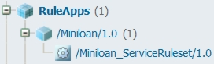
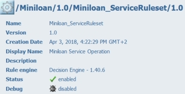
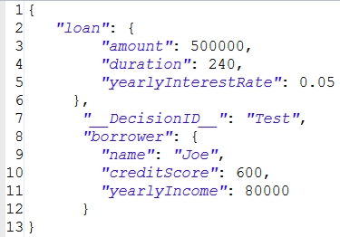
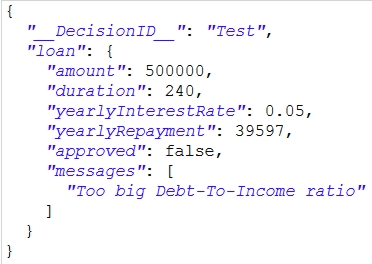
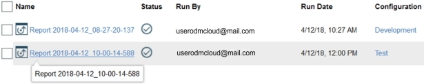

# Task 5: Testing in the execution server

You test the rules from the decision service in the execution server. When you finish, you deploy the rules to the test environment for integration testing, and then deploy them to the production environment for use with client applications.

When you deployed the rules from the decision service, they were sent as a *ruleset* in a RuleApp to Rule Execution Server in the development environment. Now, you test the ruleset in the execution server. When the ruleset passes the test, you deploy it to the test environment for integration testing, and then to the production environment for use with client applications. For more information, see [Deploying decision services](https://www.ibm.com/support/knowledgecenter/SS7J8H/com.ibm.odm.cloud.deploy/topics/odm_cloud_deploy.html).

**Note:** The information in the Rule Execution Server consoles in your cloud portal might vary from the information shown in this tutorial. For example, your consoles might display more RuleApps and different version numbers.

## Step 1: Viewing the deployed RuleApp

You find the RuleApp from the decision service in the execution server, and look at its contents.

**Procedure**
1.   Return to the cloud portal, and launch the Rule Execution Server \(Development\) console in the development environment. 
2.   Click the **Explorer** tab in the console. 
3.   In the Navigator, expand RuleApps, and then /Miniloan/1.0. Your RuleApp contains the ruleset Miniloan\_ServiceRuleset:

The RuleApp might contain more than one ruleset. You can find yours by looking at the creation dates.

4.   Click **Miniloan\_ServiceRuleset** to open the ruleset in the Ruleset View. The Ruleset View shows information about the ruleset, including its name, version number, and creation date, and provides commands for viewing performance information and adding elements such as properties. Note that the decision engine is subject to updates, and its version number can vary from what is shown in the image:

## Step 2: Testing the ruleset by using the REST API

You test the ruleset to determine whether it executes correctly. You use the REST API to run the test on manually entered data.

**Procedure**
1.   Click **Retrieve HTDS Description File** in the Ruleset View. The file retrieval page opens.
2.   Select **REST** as the service protocol type, and **OpenAPI-JSON** as the format. 
3.   Click **Test**. The Hosted Transparent Decision Service \(HTDS\) opens.
4.   Enter the following data as the run request: 

    {
        "loan": {
            "amount": 500000,
            "duration": 240,
            "yearlyInterestRate": 0.05
         },
          "__DecisionID__": "Test",
          "borrower": {
            "name": "Joe",
            "creditScore": 600,
            "yearlyIncome": 80000
          }
     }
 
Your run request should look as follows:

5.   Click **Execute Request**. You get the following server response:

The rule application produces the expected results. The loan is rejected, and a message explains that the dept-to-income ratio is too big.

6.   Close the decision service execution window. 

## Step 3: Deploying to the test environment

Satisfied that the rules work as expected, you return to the Business console to deploy the rules to the test environment. The integrator runs integration tests on the rules in the test environment. These tests determine the stability and reliability of the rules under load before they are promoted to the production environment for use with client applications.

**Note:** If you are a business user, you cannot view the test and production environments, and cannot do steps 3 and 4.

1.   Return to the Business console, and open your branch in the Miniloan Service decision service. 
2.   Open the **Deployments** tab. In Configurations, click **Test**. 
3.   Open the **Targets** tab. The Test configuration deploys the rules in the decision service to Rule Execution Server in the test environment.
4.   Click the **Deploy** button . The deployment dialog opens. It shows the Server Test Environment as the target of the deployment.
5.   Click **Deploy**, and click **OK** in the deployment status box. The list of reports opens in the Deployment tab. The new report shows that the rules have been deployed successfully:

6.   Return to the cloud portal, and launch the Rule Execution Server \(Test\) console in the test environment. 
7.   Open the **Explorer** tab in the console. 
8.   In the Navigator, expand RuleApps, and then /Miniloan/1.0. Your RuleApp contains the ruleset Miniloan\_ServiceRuleset:

9.   Click **Miniloan\_ServiceRuleset** to open the ruleset in the Ruleset View. The Ruleset View shows information about the ruleset, including its name, version number, and creation date, and provides commands for viewing performance information and adding elements such as properties. Note that the decision engine is subject to updates, and its version number can vary from what is shown in the image:

The integrator can now do nonfunctional and integration testing on the rules before they are deployed to the production environment.

**Tip:** The test shown in step 2 works in Rule Execution Server in the test environment.

## Step 4: Deploying to the production environment

When the integrator finishes testing the rules from the decision service, the rules can be deployed to the production environment. Client applications then call the rules from this environment to process data.

You must have the release manager role to deploy the rules to the production environment. If you have this role, you can see the deployment configuration for the production environment in the Deployments tab. You can use it as you did the deployment configuration for the test environment. However, there is no need to deploy the Miniloan RuleApp to the production environment. The deployment configuration for the production environment is included to provide a complete list of configurations for release managers.

For more information on calling the rules from this environment, see [Integrating decision services](http://engtest01w.fr.eurolabs.ibm.com:9193/support/knowledgecenter/SS7J8H/com.ibm.odm.cloud.integrating/topics/odm_cloud_integrating.html).

In the next task, you set up a client application to call the rules from the execution server in the development environment.

[**Next** ](../tut_cloud_getstart_ghtopics/tut_cloud_getstart_app_lsn.md)

[ **Back to table of contents**](../README.md)

© Copyright IBM Corporation 2019

