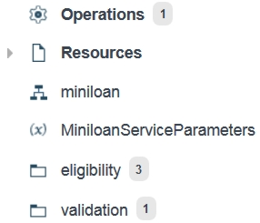
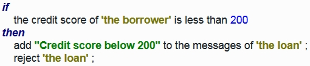
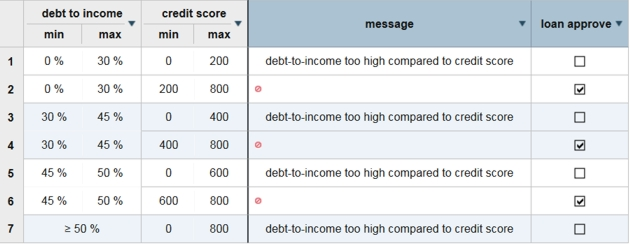
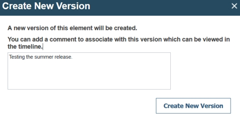

# Task 2: Touring the decision service

You look at some of the artifacts in the Miniloan Service decision service.

Companies set policies for their operations. These policies can address such matters as pricing, eligibility, and product configuration. You use Operational Decision Manager on Cloud to develop business rules that express these policies. The rules state the conditions for applying the policies, and the resulting actions. Client applications then call the rules to implement the policies.

In this task, you look at some of the artifacts in your branch of the Miniloan Service decision service.

## Step 1: Opening your branch

You open your branch and display its decision artifacts.

**Procedure**
1.   Click My Branch in the Branches tab of the Miniloan Service decision service. 
2.   Click **Decision Artifacts** to see the rule artifacts. By default, only the rules are displayed.
3.   Click **All Types**, select **All Projects** and **All Types**, and then click **Apply** to display all the artifacts in the decision service. The labels indicate the types of artifacts, and some show the number of artifacts: 

## Step 2: Exploring the ruleflow

You open the ruleflow to determine how it works.

**Procedure**
1.   Hover over **miniloan** in the list of decision artifacts. 
2.   Click the ruleflow to open it in the preview window. 

A decision service keeps its decision points in projects and folders. The Miniloan Service decision service contains one project, and two folders for different decision points. The rule in the validation folder determines whether incoming loan data is valid, and the rules in the eligibility folder apply various conditions for eligibility.

The ruleflow states the sequence for applying the rules:

The ruleflow starts by running the rule in the validation folder. If the data from a loan request passes the rule, the ruleflow directs the data to the eligibility rules. However, if the validation decision point does not approve the data, the ruleflow skips the eligibility decision point, and the decision service stops processing the loan request. For more information, see [Editing ruleflows](https://www.ibm.com/support/knowledgecenter/SS7J8H/com.ibm.odm.dcenter.bu.bconsole/ruleflows/tpc_bc_ruleflow_intro.html).

## Step 3: Exploring an action rule

You open an action rule to determine how it works.

There are two types of rules in the decision service:

-   Action rules: An action rule states a policy in a natural language. It uses conditions and actions to check the data and apply a response.
-   Decision tables: A decision table holds several action rules that share the same policy statement but use different variables. The variables are listed in condition and action columns, and each row of the table forms a complete action rule.

You start by looking at an action rule.

**Procedure**
1.   In the list of decision artifacts, click **eligibility** to open the folder in the preview window. 
2.   Click **minimum credit score** to open the action rule in the preview window. 

An action rule associates one or more actions with one or more conditions. When the conditions are met, the actions are triggered.

The rule statement in the minimum credit score rule looks as follows:

As data for the borrower enters the decision service, the action rule tests the credit score variable. If the variable is less than 200, the prescribed action is to reject the loan and work stops on the loan. If the variable is equal to or more than 200, the loan is further processed. For more information, see [Action rules](https://www.ibm.com/support/knowledgecenter/SS7J8H/com.ibm.odm.dcenter.bu.bconsole/arules/con_bc_arules_overview.html).

## Step 4: Exploring a decision table

You open a decision table to determine how it works.

**Procedure**
1.   In the list of decision artifacts, click **eligibility** to open the folder in the preview window. 
2.   Click **repayment and score** to open the decision table in the preview window. 

A decision table provides a way to view and manage sets of similar rules. Each row in a decision table represents a complete rule. The rules in the table share the same rule statement, but the condition and action values vary. The first two columns \(debt to income and credit score\) contain the condition variables, and the next two columns \(message and rejected\) contain the action variables.

The repayment and score decision table looks as follows:

When the decision table checks a loan request, it rejects the request if the borrower must pay back an annual amount that is too high for the borrower's credit score. Otherwise, the table does not reject the loan. For more information, see [Decision tables](https://www.ibm.com/support/knowledgecenter/SS7J8H/com.ibm.odm.dcenter.bu.bconsole/dtables/con_bc_dtables_overview.html).

## Step 5: Running a test suite

You add a test suite and run it to verify that the decision service works correctly before changes are made.

1.   Click **Tests** \> **Test Suites** to open the subtab. 
2.   Click the **New Test Suite** button . The dialog for creating a new test suite opens.
3.   Click **Choose**, and navigate to <InstallDir\>/odm-cloud-getting-started-master/Miniloan Service. InstallDir is your directory for the extracted files from the GitHub repository, as shown in task1, step2.
4.   Select miniloan-test.xlsx, and then click **Open**. 
5.   Click the **Save and Run** button . 
6.   Enter the information that is shown in the following image: 

7.   Click **Create New Version**, and then click **OK** in the Run Test Suite dialog. The console runs the test and switches to the Reports tab. A new report indicates a successful test by displaying a check mark in the Status column:

8.   Click the report under Recent Report. The report opens, and displays details that include the following summary:

9.   Close the report. 

In the next task, you search for the decision table, update it, and create an action rule.

[**Next** ](../tut_cloud_getstart_ghtopics/tut_cloud_getstart_rules_lsn.md)

[ **Back to table of contents**](../README.md)

© Copyright IBM Corporation 2018

