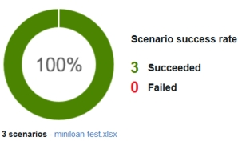

# Task 4: Testing and deploying the decision service

You test the changes to the decision service, and then deploy the rules in decision service to an execution server.

After you update the decision service, you want to make sure that it still works correctly. In this task, you run the decision service against a test scenario file. When the decision service produces the expected results, you deploy its rules to an execution server.

## Step 1: Running a test

You run a test to see whether the decision service generates expected results. For more information, see [Testing sets of rules in the Business console](https://www.ibm.com/support/knowledgecenter/SS7J8H/com.ibm.odm.dcenter.bu.bconsole/testing/con_di_tests.html).

**Procedure**
1.   Click **My Branch** in the breadcrumbs. 
2.   Click **Tests** \> **Test Suites** to open the subtab for running tests. 
3.   Hover over the Test Suite name that you added in task 2 and click the **Run** button . 
4.   Click the generated report when the run finishes and the status shows a check mark. The report shows a 100% success rate. The results produced by the decision service match the expected results.

 

5.   Click **Close** to close the report. 

## Step 2: Deploying the decision service rules

You deploy the rules in the decision service to the execution server in the development environment to further test the service. For more information, see [Deploying from the Business console](https://www.ibm.com/support/knowledgecenter/SS7J8H/com.ibm.odm.dcenter.bu.bconsole/shared_cmg_topics/con_deploy_bc.html)

**Procedure**
1.   Click the **Deployments** tab to see its contents. The tab contains the deployment configurations that are available to your user role.

The cloud portal has three standard environments: development, test, and production. You can only see the environments that are available to your user role. For example, the business user has access to only the development and test environments, and can only see the deployment configurations for these two environments.

2.   Click the **Development** deployment configuration to open it. Go through the tabs in the configuration:
    -   **General**: Provides an overview of the deployment configuration, including the name, type, RuleApp name, and base version number.
    -   **Operations**: Lists the decision operations to deploy. Here, **Miniloan ServiceOperation** is selected for deployment. Decision operations define how the rules are used in specific rulesets for deployment. Hover over the decision operation name to see its content.
    -   **Targets**: Lists where the rules can be deployed. The environment for this deployment is the development environment.
    -   **Ruleset Properties**: Defines the versioning policy for each deployment. You use the default settings.
    -   **Groups**: Lets the administrator choose which groups can deploy using this deployment configuration.
3.   Click the **Deploy** button  in the upper right corner of the window. A dialog box opens with a summary of the deployment configuration. The Target list gives you the option of deploying to the sample server or creating a RuleApp archive. 
4.   Leave **Server Development Environment** selected as the target, and click **Deploy**. A message opens with the status of the deployment.
5.   Click **OK** in the deployment status message. The Reports subtab opens in the Deployments tab.
6.   Click the report for the deployment. The report opens and shows a summary of the deployment. It shows the target server, the configuration name, the ruleset with the rules, the deployment time, the version of the ruleset, and a link to the deployment snapshot, which can be redeployed.
7.   Click the **Close** button  in the upper right corner of the window to close the report. 

In the next task, you test the rules the execution server, and then deploy the rules to the test and production environments.

[**Next** ](../tut_cloud_getstart_ghtopics/tut_cloud_getstart_res_lsn.md)

[ **Back to table of contents**](../README.md)

© Copyright IBM Corporation 2018

